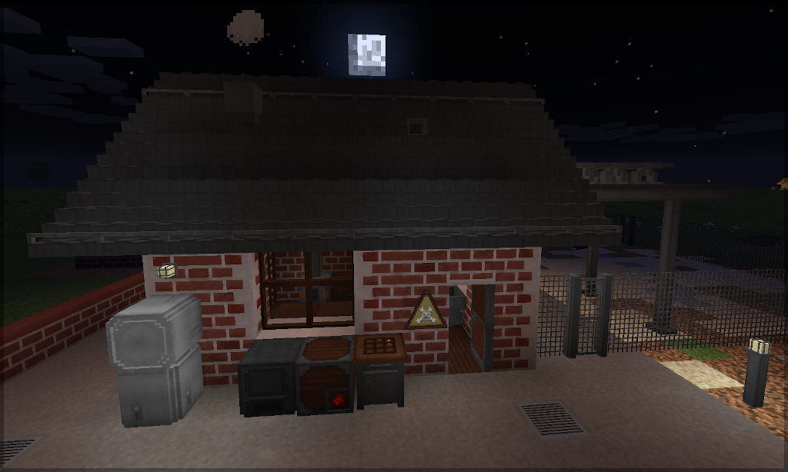
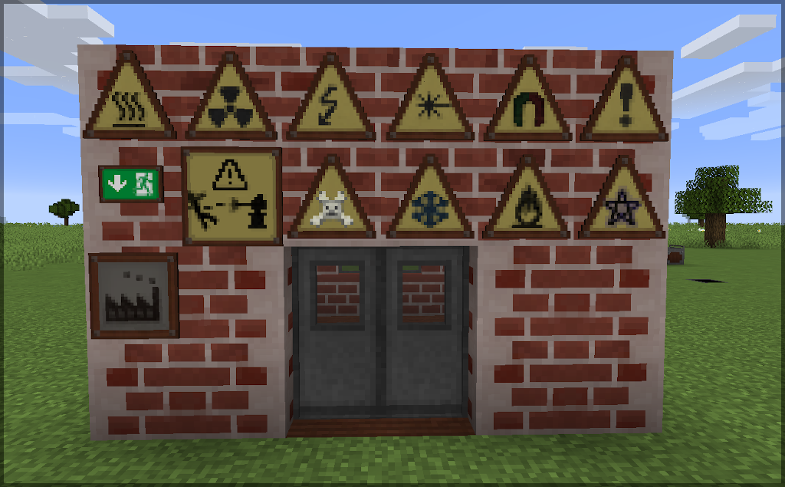
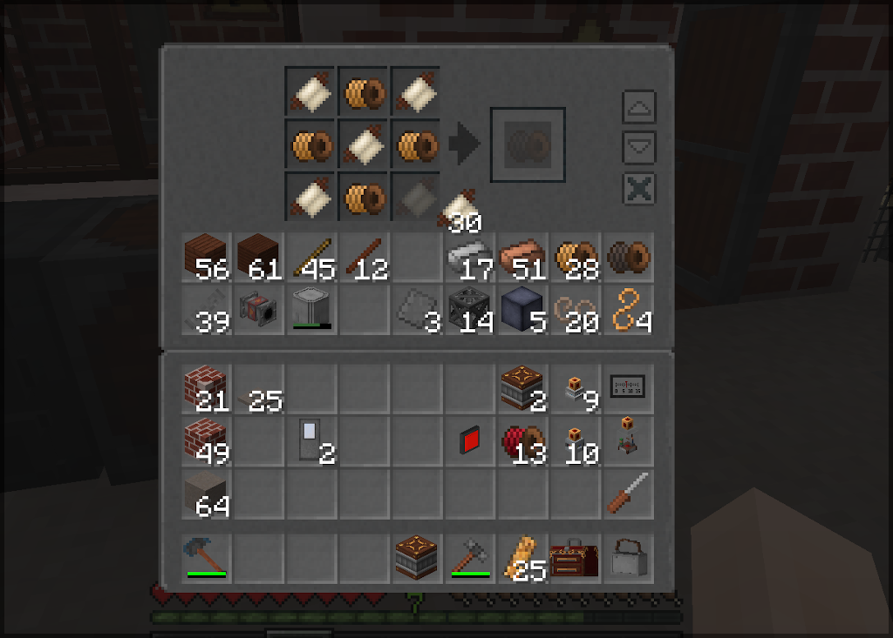
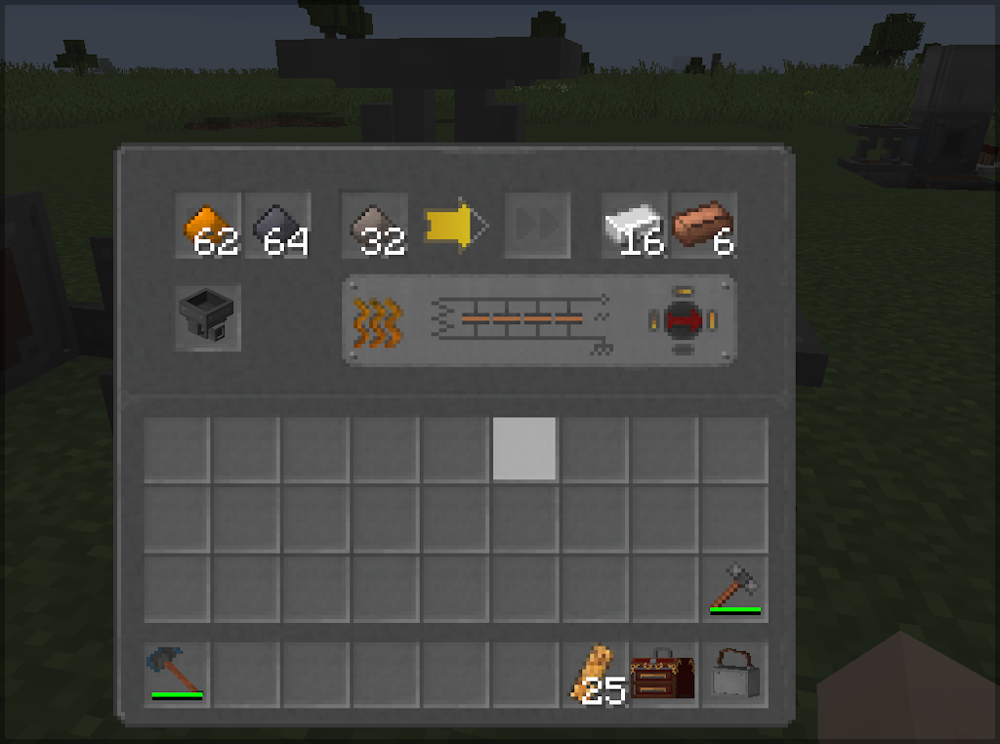

## Engineer's Decor

A [Minecraft](https://minecraft.net) (Java Edition) mod based on
[`Forge`](http://www.minecraftforge.net/), adding cosmetic blocks
for the Engineer's factory, workshop, and home.

[Screenshots in the documentation readme here](documentation/readme.md)

### Distribution file download

Main distribution channel for this mod is CurseForge:

  - Release/beta versions: https://www.curseforge.com/minecraft/mc-mods/engineers-decor/files
  - All versions: https://minecraft.curseforge.com/projects/engineers-decor/files

----
### Details

The mod has its focus decorative blocks and devices helping you to build nice
looking manufacturing contraptions. Current feature set:

- *Metal Crafting Table*: 3x3 crafting table with IE style GUI and a model
  fitting better in the engineer's workshop. Keeps its inventory, has eight additional
  storage slots on the left side of the crafting grid. Crafting history for fast
  refabrication of previous recipes. Providesa a recipe collision resolver (selection
  button for ambiguous recipes). Quick-move buttons (opt-in) to from/to storage or
  player inventory. Smart shift-click placement (balanced placing of items in the
  crafting grid). Ctrl-Shift-click places all same stacks. Scroll with the mouse over
  the crafting output slot to increase or decrease the stack sizes (shift and/or ctrl
  higher step size). Shows the placed items on the top of the table.

- *Labeled Crate*: A storage crate with 9x6 slots and a built-in item frame. As known
  from IE Crates it keeps its inventory when broken.

- *Small Laboratory Furnace*: Solid fuel consuming, updraught. Slightly hotter and
  better isolated than a cobblestone furnace, therefore more efficient. Has internal
  hopper FiFos for input, output, and fuel (two stacks each). Two auxilliary slots
  (storage tray). Keeps inventory when relocated. Can be boosted with RF power when
  a IE heater is placed in the furnace.

- *Small Electrical Furnace*: Pass-through electrical furnace. Can pull items out of
  inventories at the input side, inserts items into inventories at the output side.
  Internal fifo slots. Automatically bypasses items that cannot be cooked or smelted.
  Electrical RF/FE power can be applied on all sides. Items can be inserted or drawn
  from all sides (e.g. with filtered hopper or whatever). Fits ideally into a conveyor
  belt line/lane. Consumption and efficiency tunable via config.

- *Factory Dropper*: Dropper with GUI configurable drop force, direction, stack size,
  trigger cool-down delay, and trigger logic. Three trigger slots ("filter slots") can
  be used as internal trigger. They emit an internal signal if their item is found in
  in the dropper inventory (also at least the stack size of a trigger slot). Internal
  triggers can be easily combined with the external redstone signal trigger using
  logical *AND* or *OR* gates. If internal triggers match, the dropper will spit out
  exactly the stacks in these slots. That allows to drop e.g. always nine Lapis,
  Redstone, nuggets, etc on a conveyor to feed a compression metal press - instantly
  and automatically after nine of these items have been inserted into the dropper.
  Provides redstone pulse mode (drop like a vanilla dropper) or continuous mode
  (continue dropping as long as the redstone signal is on).

- *Factory Hopper*: Hopper with configurable stack transfer size (1 to 32), transfer
  delay, and collection range (default like hopper, area max 9x9). Can also be placed
  upwards. Has 24 slots, keeps its inventory when being broken and relocated. Tries
  to insert smartly, so that existing stacks in the target inventory are filled up first
  before empty slots are used. The redstone signal polarity can be inverted to enable
  the hopper instead of blocking it, and the reaction to redstone signal can be selected
  between "continuous" (like the vanilla hopper) or "pulsed" (means "edge detection",
  insertion like a dispenser or dropper). Default behaviour when placing is vanilla
  hopper behaviour. Note that, when collecting items, it waits until the items are
  allowed to be picked up and on the ground. This prevents that the hopper snatches
  blocks that you break when building before you can pick them up yourself.

- *Factory Block Placer*: Places blocks or plants crops/saplings in front of it.
  Supports spike planting, means it can plant e.g. from underneath the soil block.
  Automatically spits out items that it cannot plant or place. Can be redstone
  controlled similar to the Factory Hopper (invertible, pulse/continuous mode).

- *Small Block Braker*: Breaks blocks in front of it. Can be disabled by applying a
  redstone signal. The time needed to destroy a block depends on the hardness of
  that block. Provide RF/FE power to speed up the breaking process (massively).

- *Small Waste Incinerator*: Buffered and delayed item disposal device. 16 fifo
  slots are filled when new items are pushed in from any side. A GUI allows to
  take out accidentally trashed items or put in items to get rid of. When the fifo
  is full, the oldest stack will be disposed. The processing speed can be increased
  by connecting electrical RF/FE power.

- *Clinker Bricks*: Slightly darker and more colorful version of the vanilla brick
  block. Eight position dependent texture variations are implemented to make the
  wall look more "alive". Slightly higher crafting yield than making vanilla bricks.
  The recipe also allows to craft clinkers from a combination of bricks and nether
  bricks (actually, anything where the ore dictionary says it's a "brick ingot" -
  useful for bigger industrial buildings where clay is a rare resource). Higher
  explosion resistance than the vanilla bricks. Also available as stairs and wall.
  There is a reverse recipe to get three clinker brick blocks back from stairs or
  walls. There are also *Stained Clinker Bricks*, which can be mixed in Clinker walls
  for more variations.

- *Slag Bricks*: Gray-brownish brick, also eight texture variations. Has a higher
  explosion resistance than bricks. Also available as stairs and wall, also with
  reverse recipes.

- *Concrete Wall*: Solid concrete wall (not the vanilla wall design).

- *Rebar Concrete*: Steel reinforced concrete. Expensive, creeper-proof.
  Texture design oriented at the IE concrete, slightly darker, eight (position
  dependent) random texture variations with rust traces. Also creaftable in form
  of *stairs* and *walls*. Like the IE contrete *tiles*, you can craft rebar
  concrete tiles with corresponding stairs. Reverse recipes available for all
  blocks crafted from rebar concrete.

- *Gas Concrete*: Decorative concrete with high production yield and low hardness.
  Random texture variations. Also as *stairs*, *wall*, *slab*, and *slab slice*,
  reverse recipes available.

- *Ladders*: *Metal Rung Ladder*: Industrial wall-fixed ladder with horizontal bent
  rods. Climbing is faster if looking up/down and not sneaking. *Staggered Metal Steps*:
  Industrial wall-fixed sparse ladder with steps in a zip pattern. *Treated Wood Ladder*:
  Stylish wood ladder, also with faster climbing.

- *Panzer Glass*: Reinforced, dark gray tinted glass block. Explosion-proof. Faint
  structural lines are visible, multiple texture variations for seemless look.

- *Tables*: *Treated Wood Table*: Four leg table made out of treated wood. *Steel table*:
  Metal table known from industrial assembly lines or Clean Rooms.

- *Treated Wood Stool*: Simple small stool fitting to the table. You can sit on it, and
  also mobs will occationally do that (only mobs which actually can sit).

- *Treated Wood Pole*: Pole fragment that can be placed in all directions. It does
  intentionally not connect to posts, fences, etc - just a straigt pole. Can be used e.g.
  for structural support or wire relay post, where the height of the IE wire posts does
  not match.

- *Thin and thick Steel Support Poles*: Hollow steel pole fragments, can be placed in all
  directions. Also with head/food end components.

- *Double-T Steel Support*: Horizontal top-aligned support beam, placed in the direction
  you look. Auto connects to adjacent beams if facing towards them. Auto connects to steel
  poles underneath. Note: When sneaking you can pass underneath it, not all mobs sneak.

- *Industrial Lights and Lamps*: Small metal framed glowstone based light sources for ceiling,
  wall, or floor. Light level like a torch.

- *Industrial Signs*: "Danger", "Electrical Hazard", "Exit", etc. Makes a factory looking
  more alive.

- *Slab Slices*: Decorative stackable thin slabs made of of IE metal sheets, concretes,
  treated wood. Useful e.g. for roofs or ramps. Left-clicking with the same slab type in
  your hand while looking up/down removes slices again.

- *Fluid Pipe Check Valve*: IE fluid pipe styled straight valve that conducts fluids only
  in one direction. Crafted from 3x3 from three fluid pipes. Supports IE pressurized fluid
  transfer.

- *Redstone Controlled Valves*: Conduct only in one direction, on-off variant (open on redstone
  power) and analog variant (closed at power 0, linear flow slope, fully open at power 15).
  Support IE pressurized fluid transfer.

- *Passive Fluid Accumulator*: Block with one output and five input sides, that draws fluids
  out of adjacent tanks when a pump drains fluid from the output port. Implicit round-robin
  balanced drain from adjacent blocks. Random initial fluid drip-in to allow pumps to detect
  that fluids can be drained. The accumulator has a vacuum suction delay.

- *Small Solar Panel*: Produces a small amount of RF power, comparable to a IE thermal
  peltier generator over one day cycle. No power at night, reduced power when raining. The
  power curve during day time is non-linear. Useful for electrical lighting of remote places.

- *Small Tree Cutter*: A slab sized device that chops a tree in front of it. Needs by default
  about one minute, with RF power less than 10 seconds. Useful to build a contraptive automated
  tree farm. Also chops trees of the *Dynamic Trees* mod.

- *Small Mineral Smelter*: Device that slowly converts most stones or sands to magma blocks and
  finally to lava. Needs a lot of power. When the lava is cooled down in the smelter by removing
  the RF power, obsidian is generated.

- *Small Water Freezer*: Device that slowly converts water into Ice, Packed Ice, and finally
  Blue Ice. Needs RF power and time.

- *Fluid Collection Funnel*: Collects fluids above it. Has an internal tank with three buckets
  capacity. Traces flowing fluids to nearby source blocks. The fluid can be obtained with fluid
  transfer systems or a bucket. Fills only tanks below (gravity). Compatible with vanilla
  infinite-water-source creation.

- *Small Milking Machine*: Cows don't dislike being groomed and therefore occasionally stroll to
  this device, which in turn draws a bucket of milk. The milk is stored in an internal tank and
  can be retrieved directly with a bucket. For automating, the machine can interact with inventories
  at the back and below it. It preferrs pulling empty vessels from the back and putting the filled
  containers below, but if there is only one inventory, then it puts the filled containers back into
  that inventory. Also supports fluid transfer to adjacent tanks (if milk exists as fluid in the
  game), and is also compatible with the "Bottled Milk" mod (fills vanilla empty bottles).

More to come slowly but steadily.

----
### Mod pack integration, forking, back ports, bug reports, testing

  - Packs: If your mod pack ***is open source as well and has no installer***,
    you don't need to ask and simply integrate this mod. The mod has an extensive
    configuration allowing you to choose exactly which features you want, and
    additional tweaks like furni power consumption, smelting speed etc, allow
    to adapt the mod to the context it is used in.

  - Bug reports: Yes, please let me know. Drop a mail or better open an issue
    for the repository.

  - Translations: Please translate the 1.12 `lang` files in the branch `1.12`,
    and the 1.13+ JSON language files in the latest Mincraft version branch.

  - Pull requests: Happily accepted. The branches on the github correspond to
    the Minecraft versions, normally the latest revision (e.g. branch `1.16`
    is the latest 1.16.x version, branch `1.12` is 1.12.2).
    I might merge the pull request locally if I'm ahead of the github repository,
    we will communicate this in the pull request thread then.

  - The mod config has an "include testing features" option. Enabling this causes
    blocks under development to be registered as well.

----
## Version history

Mod versions are tracked in the readme files for individual Minecraft versions, and
of course in the commits of this repository. Beta and release versions that are
distributed as compiled `jar`s are tagged accordingly. Release versions are merged
into the `master` branch, while beta/alpha version tags link to `develop` branch
commits.

  - [1.12](1.12/readme.md)
  - [1.14](1.14/readme.md)
  - [1.15](1.15/readme.md)
  - [1.16](1.16/readme.md)

### Community references

Mods covering similar features, or may fit well together with IE and the decorations or features of this mod:

- [Immersive Engineering](https://github.com/BluSunrize/ImmersiveEngineering/): Without IE, my
  little mod here does not make much sense ;). It works without IE ("standalone recipes" are automatically
  selected), but the vanilla-ingredient based recipes are not as good compared to the available IE items.

- [Engineer's doors](https://www.curseforge.com/minecraft/mc-mods/engineers-doors) has brilliant
  doors, trapdoors, and fence doors, all made of the IE materials.

- [Immersive Posts](https://www.curseforge.com/minecraft/mc-mods/immersiveposts) provides extensible wire posts.

- [Dirty Bricks](https://www.curseforge.com/minecraft/texture-packs/dirty-bricks-vanilla-add-on) applies
  position dependent variations to the vanilla bricks, similar to the clinkers and slag bricks in this
  mod.

- [Chisel](https://www.curseforge.com/minecraft/mc-mods/chisel) needless to say, Chisel has a variety
  of factory blocks.

- [Actually Additions](https://www.curseforge.com/minecraft/mc-mods/actually-additions) and [Cyclic](https://www.curseforge.com/minecraft/mc-mods/cyclic)
  also have a block breakers and block placers.

### Screenshots

